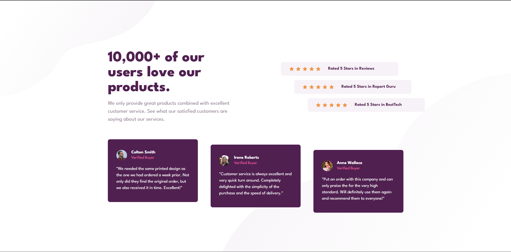

# ⭐ Social Proof Section - Frontend Mentor

Esta é a minha solução para o desafio [Social proof section challenge do Frontend Mentor](https://www.frontendmentor.io/challenges/social-proof-section-6e0qTv_bA). 

## 🎯 O Desafio

O objetivo principal deste projeto foi construir uma seção de prova social ("Social Proof") o mais fiel possível ao design original. 

Nesta primeira etapa, o foco principal foi a **estruturação e o alinhamento da versão Desktop**, lidando com desafios de posicionamento em cascata (efeito escadinha) e a aplicação de múltiplas imagens de fundo. A adaptação responsiva (Mobile) é o próximo passo mapeado para este projeto.

### 📸 Screenshot

### 🔗 Links

- **Live Site (Deploy):** ]
- **Repositório:** ]

## 🛠️ Construído com

- **HTML5 Semântico:** Utilização estratégica de tags como `<section>` e `<article>` para garantir a independência e acessibilidade de cada bloco de depoimento.
- **CSS Custom Properties (Variáveis):** Para manutenção eficiente da paleta de cores.
- **CSS Flexbox:** Para o alinhamento central e distribuição dos cards.
- **Unidades Relativas (`rem`):** Priorizando a acessibilidade e escalabilidade do layout em vez de pixels fixos.
- **Múltiplos Backgrounds:** Aplicação simultânea de texturas SVG diretamente no `body` usando a propriedade `background-image`.

## 🧠 O que eu aprendi

Neste projeto, pude consolidar conceitos muito importantes de manipulação de layout com CSS:

1. **Efeito em Cascata ("Escadinha"):** Em vez de criar várias classes no HTML, utilizei o pseudo-seletor `:nth-child()` aliado à propriedade `margin-left` para criar o espaçamento progressivo das caixas de avaliação de forma limpa.
2. **Semântica de Depoimentos:** Compreendi a importância da tag `<article>` para encapsular conteúdos autossuficientes, como os depoimentos individuais dos clientes, melhorando o SEO e a clareza do código.
3. **Agrupamento Lógico:** O uso correto de pequenas `
`s internas (como no grupo das 5 estrelas) para controlar perfeitamente o espaçamento (`gap`) usando Flexbox sem quebrar o layout externo.

## 🔜 Próximos Passos

- [ ] Implementar *Media Queries* para a versão Mobile.
- [ ] Ajustar o fluxo do Flexbox de linha para coluna (`flex-direction: column`) em telas menores.
- [ ] Resetar as margens progressivas para centralização no celular.

## 🙋‍♂️ Autor

- Portfólio - [Davi](https://thekingofpamonha.github.io/meu-portfolio/)
- LinkedIn - [Davi](https://www.linkedin.com/in/davi-luis-andrade-da-silva-974439324/)
